# 🛠️ IDP - Internal Developer Platform & Service Catalog

> **Cas d'usage :** Plateforme self-service centrale (type Spotify Backstage / Port) destinée aux équipes d'ingénierie pour bootstrapper des projets, visualiser la cartographie des microservices, piloter les déploiements et gérer les Feature Flags.

Ce type de projet appartient à la catégorie **DevTools / Internal Developer Platform (IDP)** : le domaine métier est la Tech elle-même. Il est très valorisé car il prouve la maîtrise du code **et** de l'écosystème DevOps, de l'architecture cloud et de l'outillage d'ingénierie.

---

## 1. Présentation générale

L'IDP centralise 4 grandes responsabilités :

1. **Catalogue de services** — cartographie de tous les microservices, leurs APIs, leurs bases de données et leurs propriétaires (codeowners).
2. **Scaffolding de projets** — création de nouveaux projets en 2 clics via un formulaire dynamique.
3. **Feature Flags temps réel** — activation/désactivation de fonctionnalités en production, avec déploiement progressif (canary release).
4. **Observabilité** — santé des pods/conteneurs et streaming des logs de déploiement en direct.

---

## 2. Architecture générale

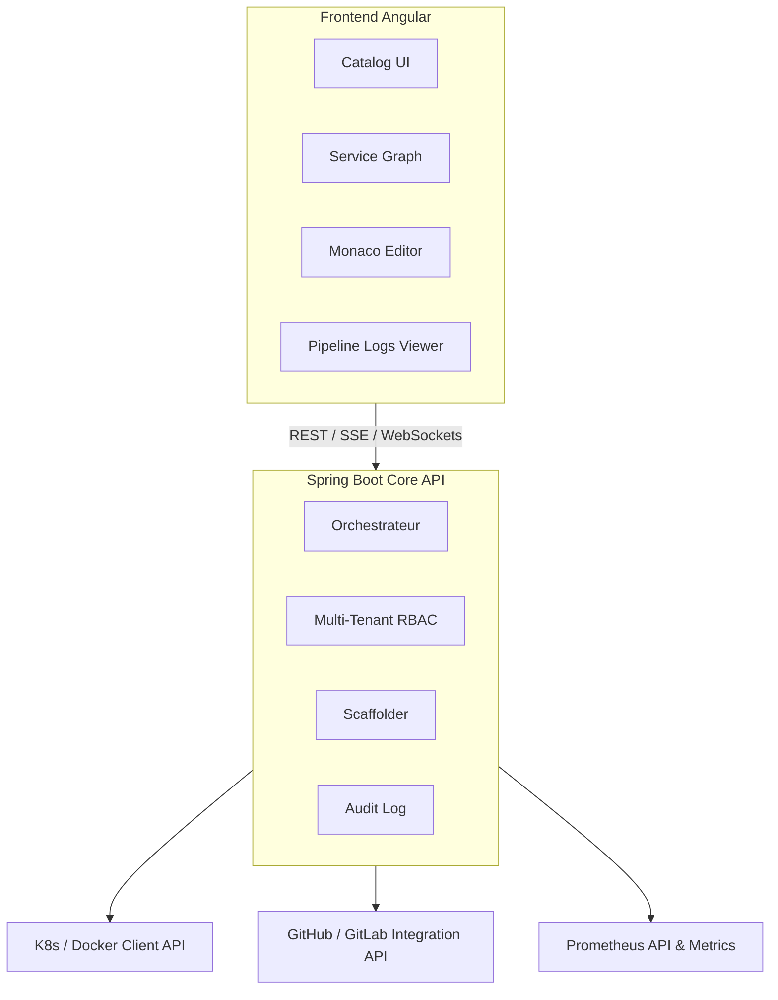

---

## 3. Fonctionnalités clés

### 3.1 Service Catalog & Graphe de dépendances

Cartographie dynamique et interactive de tous les microservices : APIs exposées, bases de données associées, propriétaires (codeowners).

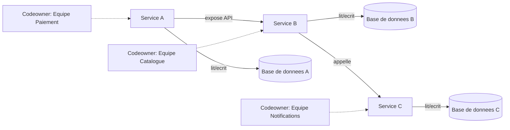

### 3.2 Scaffolder de projets (Service Creator)

Formulaire Angular dynamique permettant de créer un nouveau projet en 2 clics (ex : Microservice Spring Boot + Angular + PostgreSQL + GitHub Actions CI/CD pré-configuré). Le backend génère le dépôt Git et déclenche le premier déploiement.

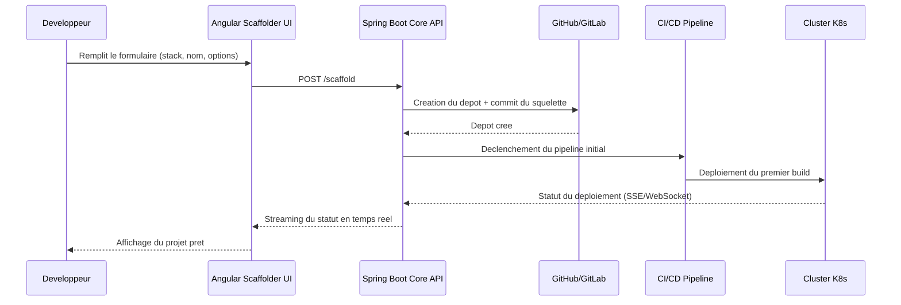

### 3.3 Moteur de Feature Flags & Canary Release

Système de gestion de Feature Toggles à ultra-faible latence pour activer/désactiver des fonctionnalités en production sans redéployer, avec déploiement progressif.

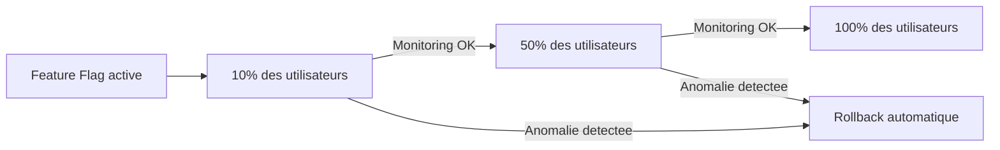

### 3.4 Console d'observabilité & Logs streaming

Agrégation de la santé des pods/conteneurs (CPU, RAM, Uptime via l'API Prometheus) et streaming en direct des logs de déploiement dans le navigateur (type terminal xterm.js).

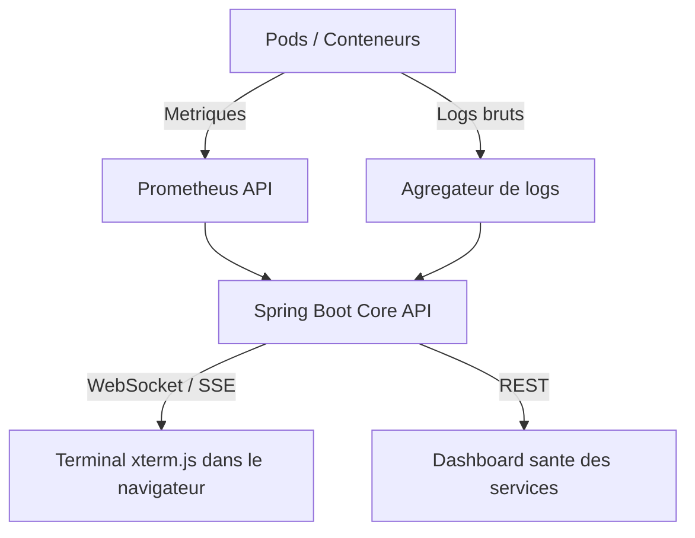

---

## 4. Stack technique

### Backend (Spring Boot)

| Composant | Rôle |
|---|---|
| Kubernetes Client / Docker Java API | Interagir avec le cluster ou le démon Docker pour provisionner et inspecter des conteneurs |
| Spring WebFlux ou WebSockets (STOMP) | Streaming bidirectionnel des logs de build et des métriques en temps réel |
| Spring Security & Keycloak | Authentification OAuth2/OIDC avec gestion fine des rôles (Admin, Tech Lead, Developer, Viewer) |
| JGit / GitHub API Client | Manipulation de dépôts Git (commit automatisé des squelettes de projet, création de Pull Requests) |

### Frontend (Angular)

| Composant | Rôle |
|---|---|
| ngx-graph / Cytoscape.js | Rendu interactif du graphe d'architecture et des dépendances entre microservices |
| Monaco Editor (ngx-monaco-editor) | Éditeur de code VS Code intégré pour éditer les fichiers de config (YAML, JSON, Dockerfile) |
| Angular Signals & RxJS | Gestion réactive de l'état du dashboard (statut des builds, métriques temps réel) |
| Terminal Emulator (xterm.js) | Terminal de logs de déploiement style GitHub Actions dans l'interface web |

---

## 5. Pourquoi ce projet est pertinent en entretien

1. **Vision "Platform Engineering"** — tendance n°1 dans les grandes équipes tech actuelles : passer du rôle de simple développeur à celui d'architecte qui construit la plateforme des autres développeurs.
2. **Technicités avancées** — pas seulement du CRUD en base de données, mais manipulation d'APIs d'infrastructure (Docker/K8s, Git, CI/CD, WebSockets) et rendu de graphes complexes côté Angular.

---

## 6. Architecture API détaillée : communication synchrone vs asynchrone

### 6.1 Vue d'ensemble

| Type | Protocole | Cas d'usage dans l'IDP | Latence attendue |
|---|---|---|---|
| Synchrone | REST (HTTP/JSON) | CRUD catalogue, création de projet, lecture de config | Réponse immédiate (ms) |
| Synchrone | REST (proxy) | Requêtes ponctuelles vers K8s API / GitHub API | Réponse immédiate (dépend du service tiers) |
| Asynchrone (push serveur -> client) | SSE (Server-Sent Events) | Statut de build en cours, avancement du scaffolding | Flux continu unidirectionnel |
| Asynchrone (bidirectionnel) | WebSocket (STOMP) | Logs de déploiement en direct (xterm.js), métriques temps réel | Flux continu bidirectionnel |
| Asynchrone (event-driven interne) | Message Queue (Kafka / RabbitMQ) | Audit log, notifications, propagation d'événements Feature Flag | Traitement en arrière-plan, découplé |
| Asynchrone (watch) | Kubernetes Watch API | Détection des changements d'état des pods (Informer pattern) | Notification quasi temps réel |

### 6.2 API REST synchrone - endpoints principaux

| Endpoint | Méthode | Description |
|---|---|---|
| /api/catalog/services | GET | Liste des services et de leurs métadonnées |
| /api/catalog/services/{id} | GET | Détail d'un service (APIs exposées, DB, owner) |
| /api/scaffold | POST | Création d'un nouveau projet (déclenche un flux async ensuite) |
| /api/scaffold/{jobId} | GET | Statut ponctuel d'un job de scaffolding (polling) |
| /api/feature-flags | GET/POST | Lecture ou création d'un feature flag |
| /api/feature-flags/{id}/rollout | PATCH | Mise à jour du pourcentage de rollout (10/50/100) |
| /api/services/{id}/health | GET | Snapshot instantané de santé (CPU, RAM, uptime) |
| /api/audit | GET | Consultation de l'audit log (paginée) |

**Principes de design REST appliqués :**

- Versioning explicite : `/api/v1/...`
- Pagination par curseur pour les collections volumineuses (`?cursor=...&limit=...`)
- Format d'erreur normalisé (RFC 7807 Problem Details) : `{type, title, status, detail, instance}`
- Idempotence garantie sur les POST de création via une clé `Idempotency-Key` en header (évite les doublons de projet en cas de retry)
- Authentification via Bearer JWT (issu du flux OAuth2/OIDC), vérifié par un `JwtAuthenticationConverter` côté Spring Security

### 6.3 Communication asynchrone

**SSE vs WebSocket : pourquoi les deux ?**

- **SSE** est utilisé quand le flux est à sens unique serveur -> client (ex : avancement d'un job de scaffolding). Plus simple, fonctionne sur HTTP standard, reconnexion automatique gérée par le navigateur.
- **WebSocket (STOMP)** est utilisé quand le canal doit être bidirectionnel ou très réactif (ex : terminal de logs où l'utilisateur peut aussi envoyer des commandes, dashboard de métriques avec abonnement/désabonnement dynamique à des topics).

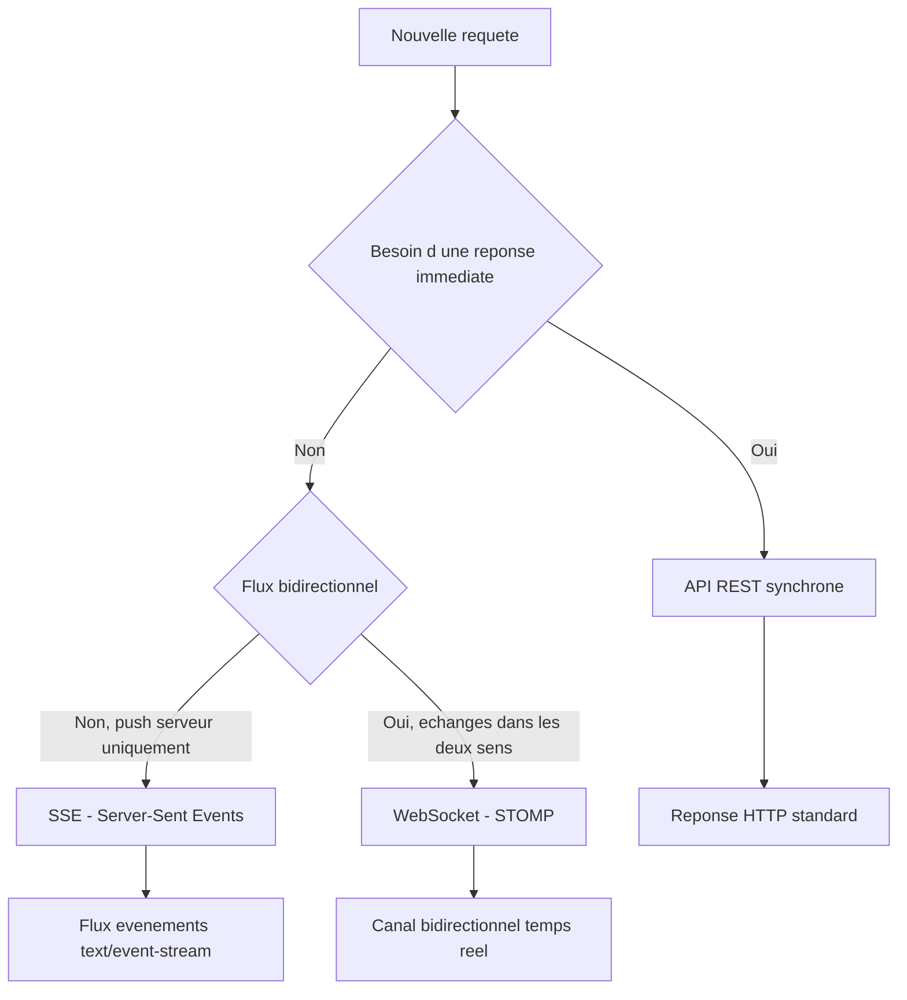

**Event-driven interne (Message Queue) :**

Les actions qui n'ont pas besoin d'être synchrones avec la réponse HTTP (audit, notifications, propagation de Feature Flags vers tous les pods) passent par une file de messages pour découpler les composants et absorber la charge.

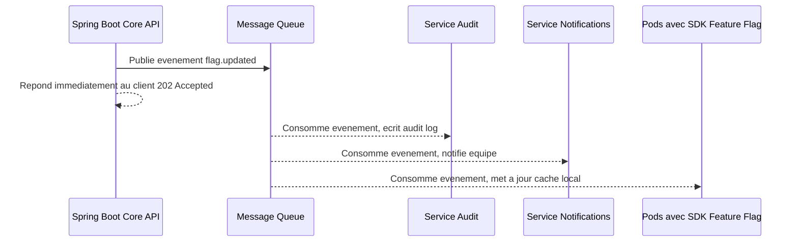

### 6.4 Flux complet combinant synchrone et asynchrone

Exemple : création d'un projet via le Scaffolder, qui mélange un appel REST synchrone initial et un suivi asynchrone du traitement.

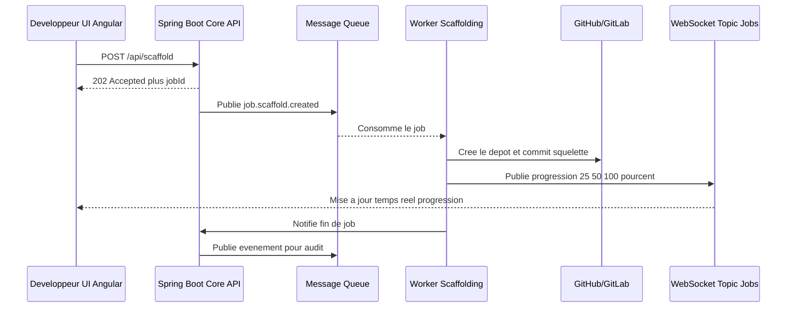

### 6.5 Pourquoi ce design (synchrone + asynchrone) ?

1. **Réactivité perçue** : le client reçoit une réponse HTTP immédiate (202 Accepted) même si le traitement réel dure plusieurs secondes/minutes (création de dépôt Git, premier build CI/CD).
2. **Découplage** : la Message Queue isole les producteurs (API) des consommateurs (audit, notifications, agents sur les pods), ce qui permet de faire évoluer chaque composant indépendamment et d'absorber les pics de charge.
3. **Cohérence avec l'existant** : ce pattern REST synchrone + événementiel asynchrone est le même que celui déjà utilisé sur ProvisionHub (dry-run, DLQ, drift detection), ce qui facilite la réutilisation de savoir-faire entre les deux projets.
4. **Résilience** : en cas d'échec d'un consommateur (ex : service Notifications down), le message reste dans la queue ou part en DLQ (Dead Letter Queue) au lieu d'être perdu ou de bloquer la requête initiale.

---

## 7. Rôle du projet

Le rôle de cette IDP n'est pas de remplacer les outils existants (K8s, Git, Prometheus), mais de servir de **couche d'abstraction unifiée** au-dessus d'eux, pour que les développeurs n'aient plus à jongler entre 5 consoles différentes.

Concrètement, la plateforme joue 3 rôles :

1. **Point d'entrée unique (Single Pane of Glass)** — un développeur consulte l'état de son service, ses logs et ses métriques à un seul endroit, sans accès direct au cluster K8s ou aux consoles cloud.
2. **Gardien des bonnes pratiques (Golden Path)** — le Scaffolder impose une structure de projet standardisée (CI/CD, structure de dossiers, conventions) dès la création, ce qui réduit la dette technique et la disparité entre équipes.
3. **Réducteur de friction opérationnelle** — les Feature Flags et le Canary Release permettent de livrer plus souvent et avec moins de risque, sans dépendre d'un ticket ou d'une intervention DevOps à chaque changement de configuration.

En résumé : c'est un produit interne, dont les "clients" sont les autres équipes d'ingénierie, et sa métrique de succès est le temps gagné par développeur (moins de contexte-switching, moins de tickets DevOps, mise en production plus rapide).

---

## 8. Diagramme de classes (modèle de domaine)

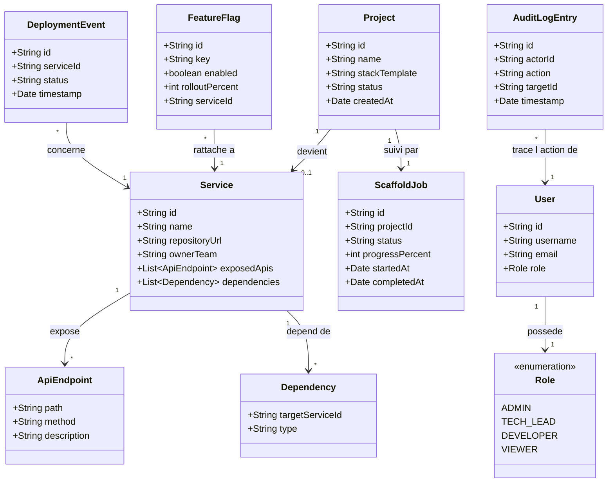

**Explication rapide du modèle :**

- `Service` est l'entité centrale du catalogue : elle connaît ses APIs (`ApiEndpoint`) et ses dépendances vers d'autres services (`Dependency`).
- `Project` représente la demande de création, suivie par un `ScaffoldJob` (le job asynchrone qui fait le vrai travail). Une fois terminé, le `Project` peut devenir un `Service` référencé dans le catalogue.
- `FeatureFlag` et `DeploymentEvent` sont rattachés à un `Service` et alimentent respectivement le moteur de rollout progressif et la console d'observabilité.
- `User` porte un `Role` (enum RBAC), et chaque action sensible est tracée dans `AuditLogEntry`.

---

## 9. Comment on va commencer (plan de démarrage)

L'idée est de construire par incréments verticaux plutôt que de tout faire en parallèle : chaque phase livre une fonctionnalité utilisable de bout en bout (frontend + backend), même minimale.

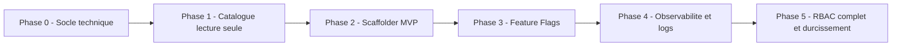

**Détail des phases :**

1. **Phase 0 — Socle technique**
   - Initialiser le repo Spring Boot (Spring Security, config OAuth2/OIDC) et le repo Angular
   - Mettre en place la CI/CD de base (build, tests, lint)
   - Définir le modèle de données initial (Service, User, Role) et la base de données

2. **Phase 1 — Catalogue de services (lecture seule)**
   - Endpoint `GET /api/catalog/services` branché sur une source simple (fichier YAML ou BDD)
   - UI Angular affichant la liste des services (sans encore le graphe interactif)
   - Objectif : avoir un premier écran utilisable par les autres équipes rapidement

3. **Phase 2 — Scaffolder MVP**
   - Formulaire de création de projet + endpoint `POST /api/scaffold`
   - Intégration Git basique (création de dépôt via l'API GitHub/GitLab)
   - Suivi de statut simple (polling), le WebSocket/SSE viendra ensuite en amélioration

4. **Phase 3 — Feature Flags**
   - CRUD des flags + endpoint de rollout progressif
   - SDK côté service pour lire les flags (cache local + rafraîchissement)

5. **Phase 4 — Observabilité et logs**
   - Intégration Prometheus pour les métriques de santé
   - Streaming des logs en WebSocket + terminal xterm.js côté frontend

6. **Phase 5 — RBAC complet et durcissement**
   - Matrice de permissions complète (Admin, Tech Lead, Developer, Viewer) sur les 4 fonctionnalités
   - Audit log complet, gestion des erreurs, tests de charge

**Par où commencer concrètement la semaine prochaine :**

- Poser le schéma de base de données pour `Service` et `User` (Phase 0)
- Brancher l'authentification OAuth2/OIDC sur le squelette Spring Boot, en réutilisant les acquis de ProvisionHub sur le `JwtAuthenticationConverter`
- Livrer l'écran "liste des services" en lecture seule pour avoir un premier retour visuel rapide (Phase 1)

---

## 10. Module RAG — Assistant de documentation intelligent (IDP Copilot)

> **Cas d'usage :** un chatbot interne, intégré à l'IDP, capable de répondre en langage naturel à des questions comme *"quel service gère les paiements ?"*, *"comment appeler l'API du Service Catalogue ?"* ou *"pourquoi mon dernier déploiement a échoué ?"*, en s'appuyant sur la documentation réelle (README, specs OpenAPI, runbooks, ADRs, logs d'incidents) plutôt que sur les connaissances génériques d'un LLM.

Ce module transforme l'IDP d'un simple catalogue consultable en un **assistant proactif**, ce qui est aujourd'hui une direction forte du Platform Engineering (cf. les plugins IA de Backstage/Port).

### 10.1 Architecture du pipeline RAG

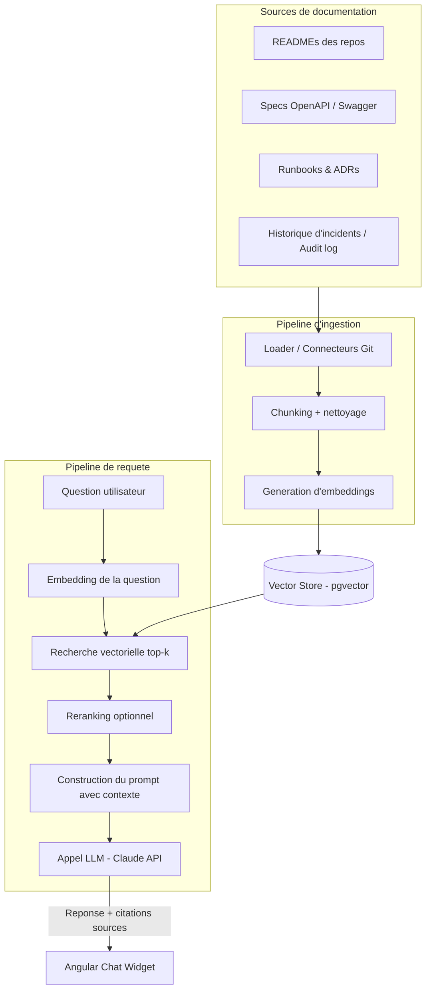

### 10.2 Flux détaillé d'une question utilisateur

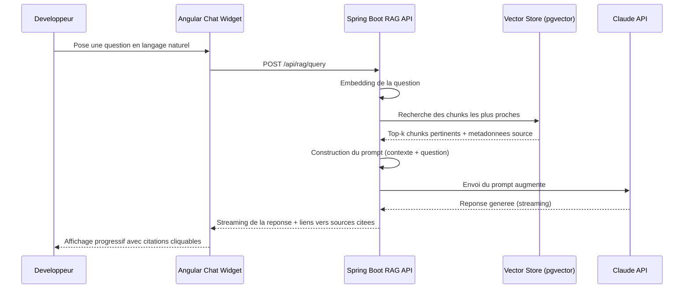

### 10.3 Ingestion et maintien à jour de l'index

L'index vectoriel doit rester synchronisé avec le code et la documentation, sans intervention manuelle :

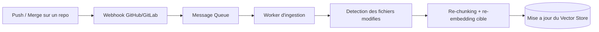

Ce pattern réutilise l'infrastructure asynchrone déjà en place dans l'IDP (Message Queue, Workers), plutôt que de reconstruire un pipeline dédié.

### 10.4 Stack technique du module RAG

| Composant | Rôle |
|---|---|
| pgvector (extension PostgreSQL) | Stockage des embeddings directement dans la base existante, sans ajouter un nouveau système (alternative possible : Qdrant/Weaviate si besoin de scaler) |
| Spring AI | Abstraction Java pour l'appel aux modèles d'embedding, la recherche vectorielle et l'orchestration RAG côté Spring Boot |
| Claude API | Génération de la réponse finale à partir du contexte récupéré, avec citation des sources |
| Connecteurs Git (JGit/GitHub API) | Réutilisés depuis le Scaffolder pour lire READMEs, specs OpenAPI et runbooks directement depuis les dépôts |
| Angular Chat Widget (SSE) | Interface de chat flottante intégrée au Catalog UI, avec streaming token par token et affichage des sources citées |

### 10.5 Endpoints principaux

| Endpoint | Méthode | Description |
|---|---|---|
| /api/rag/query | POST | Pose une question, retourne une réponse streamée avec sources citées |
| /api/rag/sources | GET | Liste des documents actuellement indexés (repo, fichier, date de dernière synchro) |
| /api/rag/ingest | POST | Déclenche une ré-indexation manuelle d'un repo ou d'un document |
| /api/rag/feedback | POST | Pouce haut/bas sur une réponse, utilisé pour améliorer le reranking au fil du temps |

### 10.6 Pourquoi ce module est pertinent en entretien

1. **Compétence IA appliquée** — ne se limite pas à "appeler une API LLM", mais couvre tout le pipeline RAG (chunking, embeddings, recherche vectorielle, prompt engineering, citations) qui est la compétence la plus recherchée actuellement sur les stacks IA en entreprise.
2. **Intégration naturelle, pas gadget** — le RAG s'appuie sur les données déjà présentes dans l'IDP (catalogue, repos Git, audit log) plutôt que d'être une fonctionnalité isolée, ce qui montre une réflexion produit et pas juste une démo technique.
3. **Réutilisation d'architecture existante** — s'appuie sur l'infrastructure asynchrone (Message Queue, Workers) et sur PostgreSQL déjà en place, évitant d'ajouter de la complexité opérationnelle inutile.

### 10.7 Où cela s'insère dans le plan de démarrage

Ce module vient logiquement après que le catalogue de services et le Scaffolder existent déjà, puisqu'il a besoin de contenu (repos, docs) à indexer :

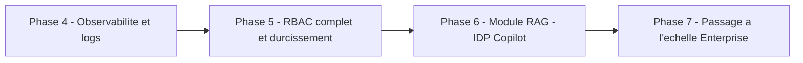

**Phase 6 — Module RAG (IDP Copilot) :**

- Activer pgvector sur la base PostgreSQL existante et définir le schéma des chunks/embeddings
- Écrire le pipeline d'ingestion initial (READMEs + specs OpenAPI des services déjà catalogués)
- Exposer `POST /api/rag/query` avec réponse simple (sans streaming) pour valider la pertinence de la recherche
- Ajouter le streaming SSE et le widget de chat Angular une fois la pertinence validée
- Brancher le webhook Git pour la mise à jour automatique de l'index

---

## 11. Passage à l'échelle Enterprise (Post-MVP Roadmap)

Pour faire passer l'IDP du **MVP** au **grade Enterprise**, l'architecture s'enrichit de 9 piliers fondamentaux de sécurité, gouvernance, résilience et conformité :

```mermaid
flowchart TB
    subgraph IAM[1. Sécurité & Identité]
        SSO[SSO/SAML/LDAP Okta/AzureAD]
        ABAC[Contrôle d'Accès ABAC Contextuel]
        Vault[HashiCorp Vault Secret Manager]
        CryptoAudit[Audit Log Cryptographique HMAC-SHA256]
        Scanner[SAST/DAST & Scan Trivy/Snyk]
    end

    subgraph MultiTenancy[2. Multi-Tenancy Reelle]
        Tenants[Tenant Isolation BU]
        Quotas[Quotas de Ressources & Telemetrie]
        K8sPolicy[Namespaces K8s & NetworkPolicies]
    end

    subgraph Resilience[3. Haute Disponibilite & Resiliation]
        MultiAZ[Multi-AZ Failover]
        CircuitBreaker[Resilience4j Circuit Breaker]
        RateLimit[Rate Limiting per Tenant]
    end

    subgraph Governance[5. Gouvernance & Policy-as-Code]
        OPA[Open Policy Agent OPA Engine]
        DualApprove[Workflows a Double Validation]
        FinOps[FinOps Cloud Cost Tracking]
    end

    subgraph Integrations[6. API Gateway & Extensibilite]
        Gateway[API Gateway Versioned v1/v2]
        PluginArch[Architecture de Plugins]
        Webhooks[Webhooks Sortants Slack/Teams]
    end

    subgraph RAGGuard[8. Qualite & Fiabilite RAG]
        Guardrails[RAG Hallucination Guardrails]
        RagasEval[Evaluation RAGAS Continu]
        FeedbackLoop[Feedback Loop Re-ranking]
    end

    IAM --> MultiTenancy
    MultiTenancy --> Resilience
    Resilience --> Governance
    Governance --> Integrations
    Integrations --> RAGGuard
```

### 11.1 Matrice des 9 Piliers Enterprise

| Domaine | Spécifications d'Ingénierie Enterprise |
|---|---|
| **1. Sécurité & Identité** | Intégration SSO SAML2/Okta/Azure AD, Contrôle ABAC (règles contextuelles par env PROD/STAGING et niveau de criticité), HashiCorp Vault pour les secrets, Audit Log avec signature HMAC-SHA256, Scans SAST/DAST automatisés (Trivy/Snyk). |
| **2. Multi-Tenancy Réelle** | Isolation stricte inter-Business Units, quotas de stockage & RAG par tenant, namespaces K8s isolés avec NetworkPolicies. |
| **3. Haute Disponibilité & Résilience** | Multi-AZ Failover, Circuit Breakers Resilience4j, Rate Limiting par tenant (`X-RateLimit-Limit`), Disaster Recovery RTO < 15min / RPO < 5min, Chaos Engineering. |
| **4. Observabilité Entreprise** | OpenTelemetry Distributed Tracing, SLO/SLA formalisés avec alertes PagerDuty/Opsgenie, Dashboards exécutifs d'adoption. |
| **5. Gouvernance & Policy-as-Code** | Open Policy Agent (OPA) pour l'enforcement des règles au scaffolding, workflows à double validation pour les rollouts critiques, FinOps tracking de coût cloud. |
| **6. API & Extensibilité** | API Gateway (Kong/Apigee) avec versioning `/api/v1/` et `/api/v2/`, architecture de plugins extensibles, webhooks sortants event-driven. |
| **7. Conformité & Legal** | SOC2 Type II / ISO 27001 readiness, anonymisation RGPD dans les logs d'audit, politique de rétention automatique des embeddings. |
| **8. Qualité du RAG** | Guardrails anti-hallucination, évaluation continue RAGAS, feedback loop pouce haut/bas pour re-ranking dynamique. |
| **9. Support & Exploitation** | Internal Status Page, Runbooks d'exploitation automatisés, self-service Backstage TechDocs onboarding. |

---

*Documentation mise à jour avec la Roadmap Enterprise Grade.*

